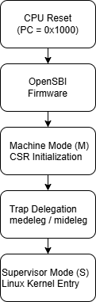
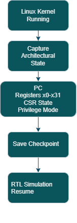

# RISC-V Boot Analysis Toolkit

This repository explores the early boot process of a **RISC-V Linux system** running in **QEMU** with **OpenSBI firmware**.
The goal is to analyze architectural state transitions during boot and investigate the minimal processor state required for **checkpoint-based RTL simulation**, particularly for platforms such as **OpenPiton**.

## Overview

Modern RTL simulators can take a long time to boot a full operating system.
Checkpointing allows the simulator to restore execution from a saved architectural state instead of repeating the entire boot process.

This project documents experiments and observations related to:

* RISC-V privilege mode transitions
* OpenSBI firmware initialization
* Control and Status Register (CSR) state during boot
* QEMU debugging using GDB
* Architectural state inspection for checkpointing

## RISC-V Boot Flow

The following diagram illustrates the high-level boot sequence of a RISC-V system running in QEMU with OpenSBI.



## Architectural Checkpoint State

The following diagram illustrates the concept of capturing the minimal
architectural state of a RISC-V processor so that execution can be resumed
without repeating the entire boot process.

In long RTL simulations (e.g., OpenPiton), checkpointing allows the system
to restore processor state and continue execution from a saved point,
significantly reducing simulation time.



## Architectural Checkpoint State

To accelerate RTL simulations, the processor state can be checkpointed after the system completes its early boot phase.

This repository investigates the **minimal architectural state required to resume execution**, including:

* Program counter (PC)
* General-purpose registers
* Control and Status Registers (CSR)
* Privilege mode state

Detailed analysis is available here:

docs/checkpoint_state.md

## Environment

The experiments were performed using the following tools:

* QEMU (RISC-V virt machine)
* OpenSBI firmware
* Linux kernel (RISC-V)
* gdb-multiarch for debugging


### Folder Description

- **docs/** – Detailed documentation explaining the RISC-V boot process, CSR analysis, debugging steps, and checkpoint architecture.
- **images/** – Architecture diagrams used in the documentation.
- **logs/** – Boot logs collected during QEMU experiments.
- **scripts/** – Helper scripts used to extract architectural state using GDB.
- **LICENSE** – MIT license for the project.
- **README.md** – Project overview and documentation entry point.

## Repository Structure
```
riscv-boot-analysis/
|
├── docs/
│ ├── boot_sequence.md
│ ├── checkpoint_state.md
│ ├── csr_analysis.md
│ ├── gdb_debugging.md
│ └── qemu_setup.md
│
├── images/
│ ├── checkpoint_state_architecture.png
│ └── riscv_boot_flow.png
│
├── logs/
│ └── linux_boot.txt
│
├── scripts/
│ └── dump_registers.py
│
├── LICENSE
└── README.md
```


