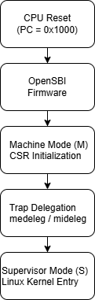
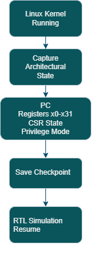

# RISC-V Boot Analysis Toolkit

This repository explores the early boot process of a **RISC-V Linux system** running in **QEMU with OpenSBI firmware**.

The goal is to analyze architectural state transitions during boot and investigate the **minimal processor state required for checkpoint-based RTL simulation**, particularly for platforms such as **OpenPiton**.

Checkpointing enables a simulator to restore execution from a saved architectural state instead of repeating the full OS boot process, significantly reducing simulation time.

---

# Overview

Booting a full Linux system in RTL simulation is extremely time-consuming.

Checkpointing provides a solution by:

- capturing architectural processor state at a stable execution point  
- saving this state as a checkpoint  
- restoring execution directly from the checkpoint  

This project investigates how checkpointing can be applied to **RISC-V systems running Linux in QEMU**.

---

# Topics Explored

This repository covers:

- RISC-V privilege mode transitions  
- OpenSBI firmware initialization  
- Control and Status Register (CSR) behavior during boot  
- QEMU debugging using GDB  
- architectural state inspection for checkpointing  
- checkpointing concepts in virtualization and OS hibernation  

---

# RISC-V Boot Flow

The following diagram illustrates the high-level boot sequence:



Boot stages:

1. CPU reset  
2. OpenSBI initialization  
3. Machine mode configuration  
4. Trap delegation (medeleg / mideleg)  
5. Transition to supervisor mode  
6. Linux kernel entry  

---

# Architectural Checkpoint Concept

Checkpointing captures the minimal architectural state required to resume execution.



Typical checkpoint components:

- Program Counter (PC)  
- General-purpose registers  
- Control and Status Registers (CSR)  
- Privilege mode  
- Relevant memory state  

Detailed analysis:  
`docs/checkpoint_state.md`

---

# Boot State Experiment

Architectural state was captured during early boot using **QEMU + GDB**.

Example observed state:
```
pc = 0x8000b64a
satp = 0x0
mstatus = 0xa00000000
medeleg = 0x0
mideleg = 0x1444
```

These observations help identify the minimal checkpoint state.

Details:  
`docs/boot_state_experiment.md`

---

# Key Findings

- Execution starts in **Machine Mode (M-mode)** under OpenSBI  
- `satp = 0` → virtual memory disabled during early boot  
- `mstatus` controls privilege transitions  
- `medeleg / mideleg` define trap delegation to S-mode  
- Control transfers to Linux in **Supervisor Mode (S-mode)**  

These findings guide identification of the **minimal checkpoint state**.

---

# Proposed Checkpoint Design ⭐

This repository also proposes a **minimal checkpointing approach**:

- capture architectural state at a stable Linux execution point  
- store processor + memory state  
- restore state to resume execution in RTL simulation  

See:  
`docs/proposed_checkpoint_design.md`

---

# Evaluation Plan

To validate checkpointing:

- verify correct execution after restore  
- compare full boot vs checkpoint restart time  
- validate CSR and register consistency  

See:  
`docs/evaluation_plan.md`

---

# Limitations

Current limitations include:

- incomplete memory state modeling  
- device state not fully considered  
- checkpoint restore not yet implemented  

See:  
`docs/limitations.md`

---

# Environment

- QEMU (RISC-V virt machine)  
- OpenSBI firmware  
- Linux Kernel (RISC-V)  
- gdb-multiarch  

---

# Repository Structure
```
riscv-boot-analysis/
│
├── docs/
│   ├── architecture_overview.md
│   ├── boot_sequence.md
│   ├── boot_state_experiment.md
│   ├── boot_state_transition.md
│   ├── checkpoint_flow.md
│   ├── checkpoint_state.md
│   ├── csr_analysis.md
│   ├── evaluation_plan.md
│   ├── gdb_debugging.md
│   ├── gdb_state_capture.md
│   ├── limitations.md
│   ├── linux_hibernation_analysis.md
│   ├── minimal_checkpoint_state.md
│   ├── opensbi_linux_transition.md
│   ├── paper_notes.md
│   ├── proposed_checkpoint_design.md
│   ├── qemu_checkpointing.md
│   ├── qemu_setup.md
│   ├── references.md
│   └── related_work.md
│
├── images/
│   ├── boot_state_transition.png
│   ├── checkpoint_flow.png
│   ├── checkpoint_state_architecture.png
│   └── riscv_boot_flow.png
│
├── logs/
│   └── linux_boot.txt
│
├── scripts/
│   ├── capture_checkpoint_state.py
│   └── dump_registers.py
│
├── LICENSE
└── README.md
```

---

# Future Work

- automate architectural state extraction  
- refine minimal checkpoint state  
- implement checkpoint restore  
- integrate with OpenPiton simulation flow  
- compare with VM snapshots and Linux hibernation  

---

# References

RISC-V Privileged Architecture Specification  
https://riscv.org/technical/specifications/

OpenSBI Firmware  
https://github.com/riscv-software-src/opensbi

QEMU Documentation  
https://www.qemu.org/docs/master/system/target-riscv.html

OpenPiton Project  
https://github.com/PrincetonUniversity/openpiton
