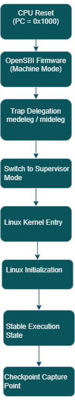

# RISC-V Boot State Transition

Understanding the processor state transitions during the boot process
is important for identifying where checkpointing can occur.

During system startup, the processor transitions through multiple
privilege modes and initialization stages before reaching a stable
execution state.

## Boot State Transition Flow

## Boot Stages

### CPU Reset

The processor begins execution at the reset vector. In QEMU virt
machines, the reset address is typically:

0x1000

Execution begins in **Machine Mode (M-mode)**.

### OpenSBI Firmware

OpenSBI runs in Machine Mode and performs platform initialization.

Key actions include:

- hardware initialization
- interrupt configuration
- trap handler setup

### CSR Initialization

Important CSRs configured during this phase include:

- mstatus
- mtvec
- medeleg
- mideleg

These registers determine how traps and interrupts are handled.

### Trap Delegation

Exceptions and interrupts are delegated from Machine Mode to
Supervisor Mode using:

- medeleg
- mideleg

### Linux Kernel Entry

After initialization, OpenSBI transfers control to the Linux kernel
running in **Supervisor Mode (S-mode)**.

### Stable Execution State

After the Linux kernel completes early initialization, the system
reaches a stable state suitable for checkpoint capture.

Checkpointing at this stage allows simulations to skip the entire
boot process.
